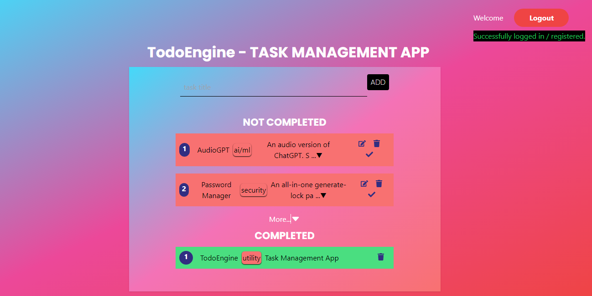

# TodoEngine - Task Management Web App

TodoEngine is a simple, yet powerful, task management application built with React and Django. It allows users to create, edit, and delete tasks, as well as manage their personal accounts.



## Features

- User authentication (login, registration, and logout)
- Task management (add, edit, and delete tasks)
- Mobile-responsive design
- Secure and fast API built with Django and PostgreSQL

## Technologies

- React
- Tailwind CSS
- Django
- Django REST framework
- PostgreSQL
- Vercel for deployment

## Getting Started

### Prerequisites

- Node.js
- npm
- vite
- Python
- pip
- PostgreSQL
- virtualenv (optional, but recommended)

### Installation

1. Clone the repository:
```
    git clone https://github.com/Afonne-CID/TodoEngine.git
```

2. Navigate to the project directory:
```
        cd TodoEngine
```

3. Set up the frontend:

   a. Navigate to the `todoengine` folder:
   ```
        cd todoengine
   ```

   b. Install the dependencies:
   ```
        yarn install
   ```

   c. Start the development server:
   ```
        yarn dev
   ```

4. Set up the backend:

   a. Navigate to the `todoengine_api` folder:
   ```
        cd ../todoengine_api
   ```

   b. Create a virtual environment and activate it:
   ```
   python -m venv venv
   source venv/bin/activate
   ```

   c. Install the dependencies:
   ```
   pip install -r requirements.txt
   ```

   d. Create a `.env` file with the following environment variables:
   ```
        DJANGO_SECRET_KEY=<your_secret_key>
        DJANGO_SECRET_KEY=<your_django_secret_key>
        POSTGRES_DB_NAME=<your_postgres_db_name>
        POSTGRES_USER=<your_postgres_user>
        POSTGRES_PASSWORD=<your_postgres_password>
        POSTGRES_HOST=<your_postgres_host>
        POSTGRES_PORT=<your_postgres_port>
   ```

To generate a strong SECRET_KEY, use the Python command `python -c ("import secrets; print(secrets.token_hex(32)))`, then copy/paste the generate string into your **DJANGO_SECRET_KEY** value

   e. Apply the migrations:
   ```
        python manage.py migrate
   ```

   f. Start the development server:
   ```
        python manage.py runserver
   ```

5. Open your browser and go to [http://localhost:8000](http://localhost:8000) to view the app. Or the right port if you changed the default port.

## Deployment

The frontend is designed to be deployed using [Vercel](https://vercel.com), and the backend can be deployed using any platform that supports Django applications, such as [Heroku](https://www.heroku.com) or [PythonAnywhere](https://www.pythonanywhere.com).

Make sure to update the `API_URL` in the `todoengine/src/helpers/index.js` and `todoengine/src/components/AuthButtons.js` files to point to the correct API URL for your backend deployment.

## License

This project is licensed under the MIT License - see the [LICENSE](LICENSE) file for details.

## Acknowledgements

- [Tailwind CSS](https://tailwindcss.com) for the styling framework
- [Django](https://www.djangoproject.com) and [Django REST framework](https://www.django-rest-framework.org) for the backend framework
- [React](https://reactjs.org) for the frontend framework
- [Vercel](https://vercel.com) for deployment support